# Hi, I'm XiaoHuiHui233 👋

> **I build systems.**

**Systems builder. Python at heart.**  
I build trading systems, infrastructure, game tooling, and things that probably didn't need to be automated.

My projects tend to start with a small problem and somehow end up involving protocols, networking, backend services, infrastructure, or hardware.

## What I work on

- 📈 **Quantitative Systems** — market data, research, backtesting, portfolio optimization, execution, and trading infrastructure
- ⚙️ **Systems & Infrastructure** — Linux, containers, databases, storage, self-hosting, automation, and distributed services
- 🌐 **Networking & Streaming** — routing, IPv6, low-latency networking, real-time communication, video pipelines, and synchronization
- 🎮 **Game & Competition Tech** — game plugins, timers, tournament platforms, broadcast tooling, and competitive infrastructure
- 🐍 **Python** — still the language I reach for first

## GitHub

<p align="center">
  
  
</p>

## This week I coded

<!--START_SECTION:waka-->

```txt
From: 16 September 2026 - To: 23 September 2026

Total Time: 5 hrs 11 mins

Python       2 hrs 37 mins   ██████████▒░░░░░░░░░░░░░░   41.29 %
Markdown     1 hr 55 mins    ███████▓░░░░░░░░░░░░░░░░░   30.36 %
Other        1 hr 9 mins     ████▓░░░░░░░░░░░░░░░░░░░░   18.25 %
CSV          22 mins         █▒░░░░░░░░░░░░░░░░░░░░░░░   05.77 %
TOML         8 mins          ▓░░░░░░░░░░░░░░░░░░░░░░░░   02.20 %
JavaScript   4 mins          ▒░░░░░░░░░░░░░░░░░░░░░░░░   01.22 %
Bash         1 min           ░░░░░░░░░░░░░░░░░░░░░░░░░   00.33 %
YAML         1 min           ░░░░░░░░░░░░░░░░░░░░░░░░░   00.30 %
```

<!--END_SECTION:waka-->

## Things I've built

### 📈 Quantitative Trading Systems

Most of my current engineering work lives around quantitative trading:

`Market Data` · `Research` · `Backtesting` · `Execution` · `Portfolio Optimization` · `Data Infrastructure`

I enjoy building the whole path from data ingestion and research tooling to production execution and infrastructure.

### 🏆 Twilight Cup

I build and maintain tooling for **Human: Fall Flat** competitive events under [TwilightCup](https://github.com/TwilightCup).

The project spans multiple layers of the competition stack:

- **Game-side tooling** — C# / BepInEx plugins, timers, input overlays, game-state integration
- **Competition services** — Python backend services and real-time communication
- **Web applications** — Vue-based tournament and operator interfaces
- **Broadcast tooling** — OBS integration, frame-level timestamps, stream synchronization
- **Infrastructure** — deployment, networking, automation, and event operations

What started as tournament tooling gradually became an end-to-end competition platform.

### 🧱 BSR

I previously ran and maintained the technical infrastructure around [BSR-Server](https://github.com/BSR-Server), a technical Minecraft community.

That meant much more than running a Minecraft server: plugins, proxies, authentication, networking, web services, automation, and the infrastructure required to keep everything working.

Minecraft has been one of my longest-running excuses to build infrastructure.

### ⛓️ Ethereum

Before moving deeper into systems and quantitative engineering, I spent a lot of time exploring Ethereum internals.

Some of that work is still public:

- **ETHFinder** — experiments around Ethereum's execution-layer networking and devp2p
- **ETHHelper** — asynchronous Geth tooling built around `httpx`, `websockets`, `web3.py`, and `pydantic`

Blockchain is no longer my main focus, but it was an important part of how I learned asynchronous networking, protocols, and distributed systems.

## Languages & Tools

`Python` · `C#` · `C` · `Java` · `Vue` · `Bash`

`Linux` · `Docker` · `PostgreSQL` · `S3` · `OpenWrt` · `Git`

I care more about understanding the system than collecting technology badges.

